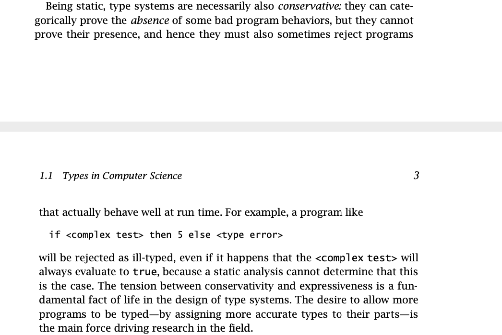
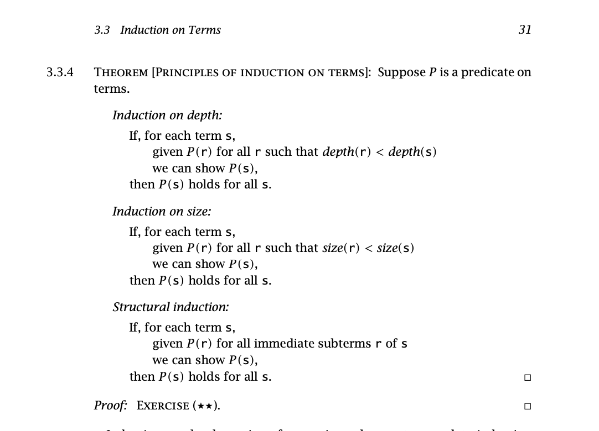
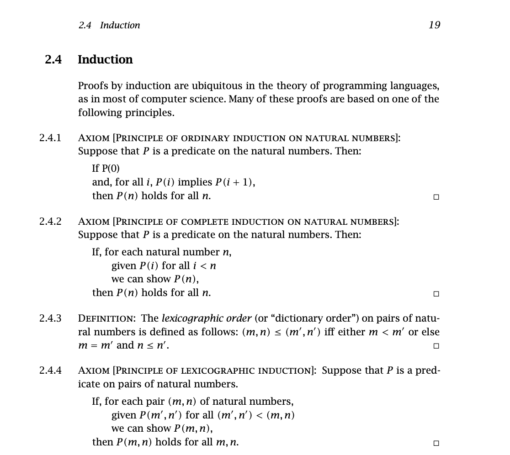
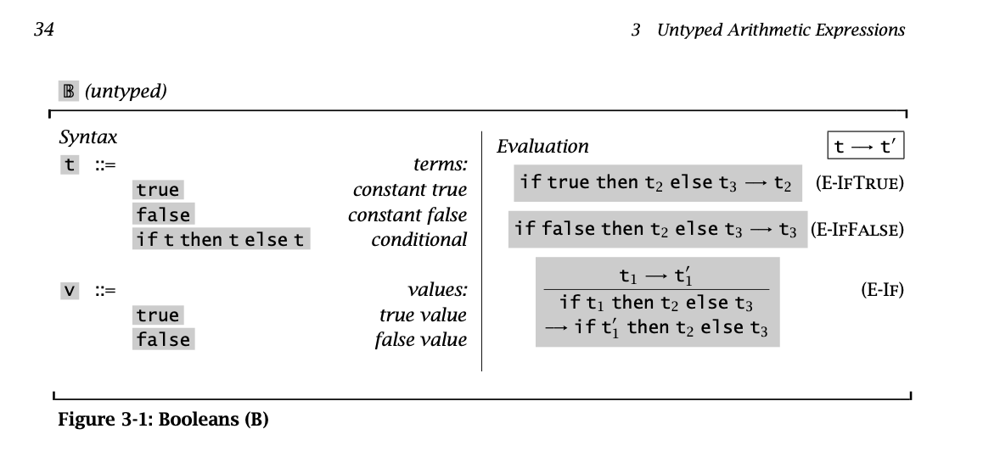
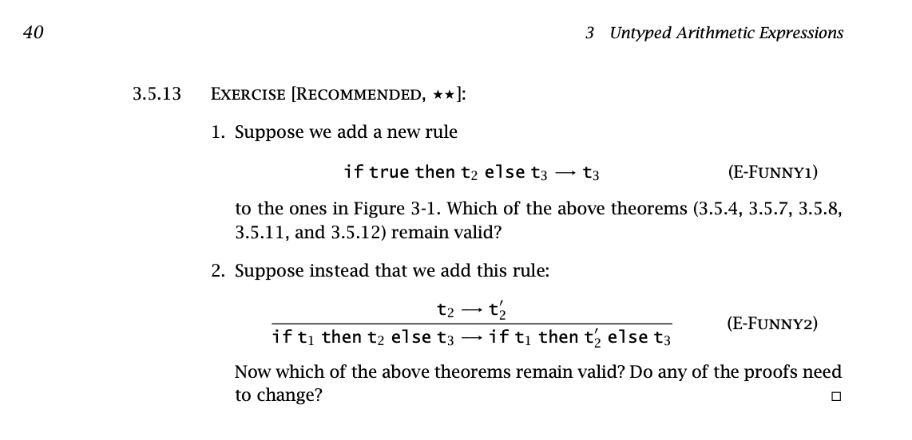

## Chapter 1

 Any reactions to "What Type Systems are Good For"?
- Detecting errors
- Abstraction
- Documentation
- Language Safety: "A safe language is one that protects its own abstractions" p6

On the limits of type systems, page 3
<!--  -->


<br> <br> <br> <br> <br> <br> <br> <br> <br> <br>
<br> <br> <br> <br> <br> <br> <br> <br> <br> <br>
<br> <br> <br> <br> <br> <br> <br> <br> <br> <br>
<br> <br> <br> <br> <br> <br> <br> <br> <br> <br>


```
if <complex test>:
    return 5
else:
    // incorrect types:
    return true * 5
```

<br> <br> <br> <br> <br> <br> <br> <br> <br> <br>
<br> <br> <br> <br> <br> <br> <br> <br> <br> <br>
<br> <br> <br> <br> <br> <br> <br> <br> <br> <br>


### p31 3.3.4


<!--  -->


<br> <br> <br> <br> <br> <br> <br> <br> <br> <br> <br> <br> <br> <br> <br> <br> <br> <br> <br> <br> <br> <br> <br> <br> <br> <br> <br> <br> <br> <br>


p39
3.5.10




- theorem 3.5.4 (determinacy of single-step evaluation) is
    If t -> t' and t -> t'' then t' = t''
- theorem 3.5.7 is that every value is in a normal form

- theorem 3.5.8 is that every expr in normal form is a value
- theorem 3.5.11 is uniqueness of normal forms

Which properties hold if we add E-Funny1?


<br> <br> <br> <br> <br> <br> <br> <br> <br> <br> <br> <br> <br> <br> <br> <br> <br> <br> <br> <br> <br> <br> <br> <br> <br> <br> <br> <br> <br> <br>

%
p43
3.5.18

Small step:

```

t2 -> t2'
------------------------
if t1 then t2 else t3 -> if t1 then t2' else t3


t3 -> t3'
-------------
if t1 then v2 else t3 -> if t1 then v2 else t3'

t1 -> t1'
--------------
if t1 then v2 else v3 -> if t1' then v2 else v3

```

Big step:
(does this really express order of evaluation?)

```
t2 => v2
t3 => v3
t1 => true
------------------------(B-IfTrue)
if t1 then t2 else t3 => v2

t2 => v2
t3 => v3
t1 => false
------------------------(B-IfFalse)
if t1 then t2 else t3 => v3
```

<br> <br> <br> <br> <br> <br> <br> <br> <br> <br> <br> <br> <br> <br> <br> <br> <br> <br> <br> <br> <br> <br> <br> <br> <br> <br> <br> <br> <br> <br>
<br> <br> <br> <br> <br> <br> <br> <br> <br> <br> <br> <br> <br> <br> <br> <br> <br> <br> <br> <br> <br> <br> <br> <br> <br> <br> <br> <br> <br> <br>
<br> <br> <br> <br> <br> <br> <br> <br> <br> <br> <br> <br> <br> <br> <br> <br> <br> <br> <br> <br> <br> <br> <br> <br> <br> <br> <br> <br> <br> <br>
<br> <br> <br> <br> <br> <br> <br> <br> <br> <br> <br> <br> <br> <br> <br> <br> <br> <br> <br> <br> <br> <br> <br> <br> <br> <br> <br> <br> <br> <br>

p42
2 3* exercises